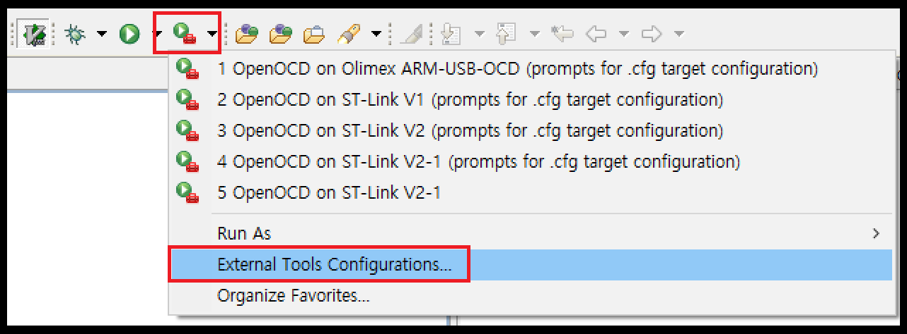

# study_chibios_linux
   
This is a sibling repository of ["study_chibios"](https://github.com/bus710/study_chibios).  
However, this repo aims Linux users.
  
## Maintainer
  
SJ Kim  
- Profile: [bus710.net](http://bus710.net)  
- Contact: <<bus710@gmail.com>>  
   
## Index

- [Hardware](#Hardware)
- [Installation](#installation)
	- Basic tools
	- Cross tool chain
	- Eclipse Neon and plug-ins  
- [Setting Eclipse](#setting-eclipse)
- [Project importing and compiling](#project-importing-and-compiling)
- [Setting OpenOCD](#setting-openocd)
	- External Tools Configuration
	- Debug Configuration
- [Debugging](#debugging)

## Hardware

Below Hardwares are required.
- A host machine (with linux)
- A target machine (VESC in our case. STM32F4-DISCO is good, too)
- A STLINK-V2 (or a SWD compatible board)
- A Power Supply Unit (Should be able to supply 12V 3A)

## Installation
  
ChibiOS project provides a very convenient tool, which is ChibiStudio for windows users. Linux (and Mac) users need to install Eclipse, Cross tool chain, and OpenOCD by themself though, it is not too complex (Actually we even don't need to compile any tool). Here, I assume that you have a PC with Vanilla **Ubuntu 16.04**.   

### Basic tools

After install Ubuntu, you may follow below commands.

```
$ sudo apt-get update
$ sudo apt-get install build-essential
$ sudo apt-get install eclipse
$ sudo apt-get install openocd
$ sudo apt-get install git
```

### Cross tool chain

In order to get the ARM cross compiler, you may follow below commands.
  
```
$ sudo add-apt-repository ppa:team-gcc-arm-embedded/ppa
$ sudo apt-get update
$ sudo install gcc-arm-embedded
```

### Eclipse Neon and plug-ins
  
Although we already installed Eclipse from the official repository, we will use a newer Eclipse, which is "Neon". (However, by installing Eclipse with command line, we can easily have required tools like JDK for Eclipse.)  
  
In order to get Eclipse Neon, 
- visit this link [>>>](http://www.eclipse.org/downloads/packages/eclipse-ide-cc-developers/neon2).  
- If you click "Download" button on the web page, it might give you a flie **"eclipse-inst-linux64.tar.gz"**. 
- Extract the file (either using gunzip in the terminal or right clicking in the file browser).  
- Go to the directory and run the installer by right clicking **"eclipse-inst"** in the file browser. 
- Choose **"C/C++"** environment.
- That will automatically install Eclipse Neon but you should update by visiting **"Help > Check for Updates"**.

Once the Eclipse installation is done, 
- You can run Eclipse and navigate to **"Help > Install New Software"**.  
- In the Dialog, you can find a text input **"Work with:"**. 
- Type Neon, then it will give you few choices. Click **"Neon - http://download.eclipse.org/releases/neon"** from that dialog (not this page's!).
- Below that, you also can fine a text input **"type text filter"**.
- Type **"C/C++ GDB Hardware Debugging"** and install.
- With the same manner, install **"C/C++ Remote Launch"** as well.

After installing the plug-ins, disable the option "Build Automatically".
- Click **"Project > Build Automatically"**.
  
## Project importing and compiling
  
Now, we are ready to get the code from this repository.
  
```
$ cd ~
$ git clone https://github.com/bus710/study_chibios_linux
```
  
From Eclipse, you can import a project as follow.
- Go to **"File > New > Makefile Project with Existing Code"**.
- You may see the **"New Project"** dialog.
- Click **"Browse"** and find a directory as **"study_chibios_linux/p003"**.
- Click **"Cross GCC"**.
- Click **"Finish"**.

From Eclipse, you can compile the project, which you just imported, as follow.
- Click **"Project > Build All"**.
- Check the console log of Eclipse. (Can you see "Build Finished"?)

## Setting OpenOCD
  
OpenOCD is little bit different from other debuggers since it has server-client structure.  
OpenOCD server works on the ST's debugging hardware.  
OpenOCD client works with Elclipse (or any other IDEs).  
  
Therefore, we need to set up OpenOCD server with "External Tools Configuration" menu.  
  
  
Also we need to set up OpenOCD client with "Debug Configuration" menu.   
  

### External Tools Configuration  
  
I believe that you can find the icon from the toolbar.
- Click the menu **"External Tools Configuration"**.  
- Right click on **"Program"**.
- Type **"/usr/bin/openocd"** for Location.
- Click **"Browse File System"** for Working Directory and point to the project directory "p003".
- Type **"-c "telnet_port 4444" -s "scripts" -f "interface/stlink-v2-1.cfg" -f "board/stm32f4discovery.cfg" "** for Argument.
- Click **"Apply"**.
- This is it for OpenOCD server!
  
### Debug Configuration
  
I also believe that you can find the icon from the toolbar
- Click the menu **"Debug Configuration"**.
- Right click on **"GDB Hardware Debugging"**.
- Click **"Browse"** for Project and point to the project directory "p003".
- Move to **"Debugger"** tap.
- Type **"3333"** for Port Number.
- Click **"Apply"**.
- This is it for OpenOCD client!
   
## Debugging
  
Invoking the debugging mode is pretty easy.  
- Launch the OpenOCD server first.
- Run the OpenOCD client with a built binary.
  
However, Debugging itself is not easy so that we may discuss in a following session.  
  
## References
   
[1] http://www.chibios.org/dokuwiki/doku.php  
[2] http://vedder.se/2015/01/vesc-open-source-esc/  

